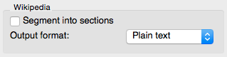
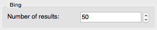

.. meta::
   :description: Orange Textable Prototypes documentation, WebSearch, Twitter, Wikipedia, Bing
                 widget
   :keywords: Orange, Textable, Prototypes, documentation, WebSearch, Twitter, Wikipedia, Bing
              widget

.. _WebSearch:

##################################
WebSearch
##################################

Import Twitter, Wikipedia and Bing data.

1. Signals
**************
Inputs : None

Outputs : WebSearch_data (by default)

2. Description
**************
The WebSearch widget is designed for the Orange Canvas environment to generate textual data retrieved from Twitter, Wikipedia or Bing. 
Depending on the service, the output segmentation has the following annotations with keys :

* Twitter : date, source, search, url and author.
* Wikipedia : source and search.
* Bing : url, source, search and title.

The interface of WebSearch adapts itself according to the selected service.

2.1 Interface
~~~~~~~~~~~~~~~~~~
As stated before, the interface is dependent of the selected service. In case Twitter is chosen, the interface looks like this :

*Figure 1 : WebSearch widget with Twitter selected*

The **Service** field allows the user to select a search engine (Twitter, Wikipedia or Bing).

The **Language** field enables the user to choose the language of the retrieved data between english, french, german, spanish, italian and dutch  (by default : english). 

The **Query** field contains the searched word(s) on the chosen web engine. By default, the language is set to English.

By default, the **Output segmentation label** is named `WebSearch_data`. Users can however modify it if needed. 

Clicking on the **Send** button executes the request. The **Info** box above indicates the number of segments sent (in case any matches the request). For more informations about the **Info** box : read `3. Messages`_.

Depending on which search engine is selected, different options appear on the interface. These specific aspects are stated below.

2.1.1 Twitter
~~~~~~~~~~~~~~~~~~
The **Number of tweets** field allows users to retrieve up to 3000 tweets, in case the request matches as many tweets as required by the entered number.  

When **Include retweets** is checked, tweets starting with 'RT' are filtered out in order to only send "original" tweets to the output. It is worth noting that the number of segments in the output may, in somes cases, actually be lower than the value entered in **Number of tweets**. 

Twitter allows their users to own a license key. To unfold the license key parameters, tick the **Use license key** checkbox. Four keys (which can be found under "Keys and Access Tokens" in user's account) are needed. Visit apps.twitter.com to learn more. 

*Figure 2 : Twitter options box with license key parameters*

2.1.2 Wikipedia
~~~~~~~~~~~~~~~~~~

*Figure 3 : Wikipedia options box*

When **Segment into sections** is checked, Wikipedia articles are divided into sections : each segment contains a section. 

The **Output format** is either "Plain text" or "HTML".

2.1.3 Bing
~~~~~~~~~~~~~~~~~~

*Figure 4 : Bing options box*

The **Number of results** field allows users to retrieve up to 1000 Bing results, in case the request matches as many results as required by the entered number.

3. Messages
**************

3.1 Information
~~~~~~~~~~~

*Setting changed. Click send.*
    This message informs the user that the settings have been changed and are ready to be sent. 

*Data correctly sent to output: <n> segments.*
    The data, containing <n> number of segments, has been sent to the output correctly.

*No data sent to output yet. Please try to change query and settings.*
    The query didn't retrieve any data. When confronted to this message, the user should either try to change the query or modify the settings.

*Settings were changed, please click 'Send' when ready.*
    Unless the **Send automatically** checkbox is selected, any changes in the settings require to click "Send".
    
*No data sent to output yet, see 'Widget state' below.*
    A problem with the instance's parameters and/or input data prevents it
    from operating properly, and additional diagnostic information can be
    found in the **Widget state** box at the bottom of the instance's
    interface (see `3.2 Warnings`_ and `3.3 Errors`_ below).

3.2 Warnings
~~~~~~~~

*No label was provided.*
    A label must be entered in the **Output segmentation label** field in
    order for computation and data emission to proceed.

3.3 Errors
~~~~~~~~~~~
*Wrong keys for Twitter api.*
    The entered values don't match any existing key.

